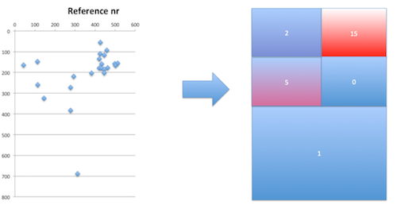

# Positional ordering

## About

This project *positional-order* can be used in selecting the most likely value from several candidates for a payment field. It takes use of geometrical position of each candidate, as a text phrase on the invoice.

## Solution

We provide a data structure built on top of implicit k-d tree (implicit k-d tree - k-d tree on top of a predefined rectilinear grid). Grid constants are defined in *ee.pdfarve.common.geom.Dimensions*.

Each tree leaf node stores the data point locations in its associated cell, and each inner node stores the number of data points in its children. Iterative updating propagates a new data point top-down and can split a cell.

## Training

First task is to find the most likely location for each payment field on invoice. Sample invoices need to be collected and data points extracted. 

After that, k-d tree (one tree for each different field type) needs to be initialised with training data that determines the most likely positions for a payment field. Then this tree structure can be used with geometrical positioning data in ordering candidate values for a payment field. See tests inside *ee.pdfarve.common.posorder.NodeTest.java* for how the data structure can be trained.  

## Example

Reference number locations on Estonian invoices yielded most of the data points cluttered in the upper right cell, which is therefore the most likely place to find the value for reference number.

## Comparing

Comparing two candidates is implemented on the area size of the bigger cell. The comparator itself is implemented in *ee.pdfarve.common.posorder.CandidatesComparator*. See an example illustrating comparing reference number candidates below.

In the beginning there are probably only a small number of data points.  Cell areas should be kept bigger to have more values in cells.

